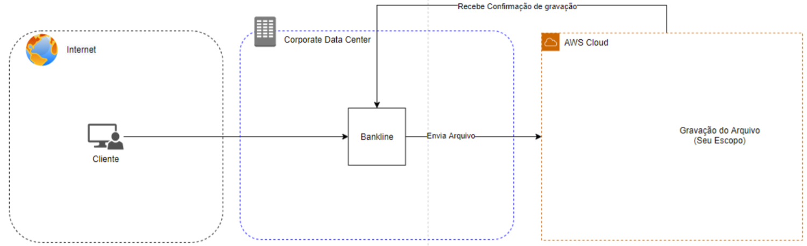

# Desafio

### Teste 1 - Calculadora de CDI
Existe uma biblioteca responsável por calcular diariamente os juros dos investimentos dos clientes baseados em CDI (Certificado de Depósito Interbancário). Esses cálculos geram posições que são disponibilizados para outros sistemas que precisam da informação.

Cada operação na carteira tem os atributos:
* Contrato - Número do contrato com o cliente
* Data Início - Data que o cliente fez o investimento.
* Data Fim - Dataque o cliente receberá o dinheiro corrigodo
* % do CDI: Percentual do CDI que será usado para calcular o valor final da operação
* Valor Investido: O valor que o cliente investiu e será valorizado até o a data final do contrato.
* Valor Corrigido: O valor Investido mais o juros até o dia do cálculo

Cada operação deverá obrigatoriamente gerar uma posição caso o contrato esteja vigente, ou seja, o dia do cálculo estiver entre o início e fim do contrato. Esta posição terá a informação do dia do cálculo, um Id aleatório pra que os outros sistemas consigam rastrear a posição e as informações da operação em si.

A área de negócio verificou na conciliação que algumas operações não estão gerando posição. Você precisa entender o que está acontecendo e corrigir o mais rápido possível, pois além das outras áreas estamos afetando os clientes. Conseguimos preparar uma massa de testes onde aparentemente o erro está acontecendo.

### Teste 2 - API de Feriados
Precisamos que você elabore um desenho de solução para envio e gravação de um arquivo PDF que representa um contrato assinado por um cliente e realize seu desenvolvimento conforme abaixo:

Um cliente tem no bankline a possibilidade de enviar seus documentos para contratação de um produto do banco, ele preenche seus dados no portal e anexa os documentos no formato PDF, ao salvar o bankline:
1. Gravará os dados do cliente
2. Acionará a API de gravação do arquivo (API que você deve desenhar e construir)
3. Confirmará o registro dos dados

O seu escopo se limita a disponibilizar uma API para ser acionada pelo Bankline e disponibilizar o retorno desta gravação, sendo que esta comunicação ocorrerá de forma assíncrona, o envio do arquivo e a leitura do retorno pelo bankline são responsabilidade de outra squad. O Bankline está hospedado em uma infraestrutura on-premise tendo de se integrar com sua aplicação na cloud pública.
